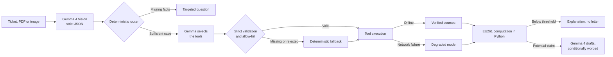

# Droit de Retard

[](https://github.com/Wesper-Dev/droit-de-retard/actions/workflows/tests.yml)

**🇫🇷 [Version française](README.fr.md)**

A local-first assistant that prepares EU261 air passenger compensation claims.


From a PDF or image of a ticket, the prototype extracts the facts with Gemma 4,
asks for whatever is missing, searches official sources and computes a
potential compensation with deterministic Python rules. It can refuse to
generate a letter, and it degrades carefully when web search is unavailable.

> This prototype is informational: it does not provide legal advice, does not
> represent the passenger and does not guarantee any compensation.

## Why an agent?

The outcome is not always a letter. The pipeline chooses between:

- asking for the arrival delay or another missing piece of evidence;
- searching for the applicable rules and the claim channel;
- explaining a non-eligibility without producing a letter;
- preparing a conditional claim when live sources are unavailable.

Native Gemma/Ollama function calling drives the research. Gemma receives the
strict JSON schemas of the three tools and produces `message.tool_calls`; a
Python allow-list dispatcher then validates the name and requires exactly the
arguments derived from the minimised context. Results are returned to the model
with the `tool` role when a second round is needed. If a call is missing,
invalid or never produced, a deterministic fallback runs only the authorised
tools and makes that recovery visible in the trace.

## Architecture



Gemma reads the document and drafts the letter. The code keeps responsibility
for thresholds, distance, amounts and every safety branch.

| File | Role |
| --- | --- |
| `agent.py` | Multimodal extraction, routing, research, drafting and trace |
| `eu261.py` | Simplified EU261 distance and qualification rules |
| `tools.py` | Minimised SerpApi search, local corpus and offline recovery |
| `knowledge/airline_policies/` | Local procedural corpus for airlines |
| `knowledge/carriers.json` | Carrier identities and official domains |
| `app.py` | Local HTTP server with no external Python dependency |
| `static/index.html` | Demo interface |
| `test_agent.py` | Deterministic tests |
| `scripts/` | Manual checks, outside the automated suite |
| `docs/` | Maintained specifications and analyses |
| `docs/hackathon/` | Frozen July 2026 archive, no longer maintained |

Work in progress and remaining debt are tracked in [`ROADMAP.md`](ROADMAP.md)
(in French); the target architecture and its build plan live in
[`docs/ARCHITECTURE_CIBLE.md`](docs/ARCHITECTURE_CIBLE.md). Measured figures —
test count, latency, coverage — live in [`docs/EVALUATION.md`](docs/EVALUATION.md),
their single point of truth.

**See the output without installing anything:** [`examples/`](examples/)
contains the full response of a real run, its agent trace and the local corpus
result, versioned as-is.

## Where to look

If you only open five files, open these. The links are pinned to a commit, so
the line numbers stay valid.

- **[`_validate_tool_call`](https://github.com/Wesper-Dev/droit-de-retard/blob/b0fcc016253601b1e28b09db5592998c75591e7c/agent.py#L810-L835)** — when Gemma requests
  a tool, the code does not resolve the name it gives. It **recomputes** the
  expected arguments in Python and rejects anything that differs, byte for
  byte. The model chooses; it does not command.
- **[`_execute_research_tool`](https://github.com/Wesper-Dev/droit-de-retard/blob/b0fcc016253601b1e28b09db5592998c75591e7c/agent.py#L838-L848)** — a literal chain of
  `if` statements, no dynamic resolution. Three boring lines where the
  ecosystem norm is still `globals()[name](**args)`, i.e. executing a function
  named by the model.
- **[`_validate_claim`](https://github.com/Wesper-Dev/droit-de-retard/blob/b0fcc016253601b1e28b09db5592998c75591e7c/agent.py#L1101-L1155)** — the counterpart on
  the output side: the letter drafted by the model is cross-checked against the
  engine. A diverging amount is replaced; a URL absent from the sources is
  flagged.
- **[`qualify_delay`](https://github.com/Wesper-Dev/droit-de-retard/blob/b0fcc016253601b1e28b09db5592998c75591e7c/eu261.py#L325-L423)** and
  **[`resolve_airport`](https://github.com/Wesper-Dev/droit-de-retard/blob/b0fcc016253601b1e28b09db5592998c75591e7c/eu261.py#L132-L155)** — the legal decision and
  the airport resolution, in deterministic Python testable offline. The model
  never computes an amount. `resolve_airport` asks a question rather than
  choosing when a label is ambiguous.
- **[`classify_cause`](https://github.com/Wesper-Dev/droit-de-retard/blob/b0fcc016253601b1e28b09db5592998c75591e7c/eu261.py#L314-L322)** — case law in the code:
  a technical fault (CJEU Wallentin-Hermann C-549/07) and a strike by the
  carrier's own staff (Krüsemann C-195/17) do not exonerate the carrier, while
  an air traffic control strike may. A risky cause never means refusal: the
  burden of proof lies with the airline.

The two tests that lock this boundary:
**[a model trying to read `.env`](https://github.com/Wesper-Dev/droit-de-retard/blob/b0fcc016253601b1e28b09db5592998c75591e7c/test_agent.py#L700-L723)** and
**[a personal detail slipped into a tool-call argument](https://github.com/Wesper-Dev/droit-de-retard/blob/b0fcc016253601b1e28b09db5592998c75591e7c/test_agent.py#L728-L753)**,
both rejected.

## Requirements

- Python 3.10 or newer;
- [Ollama](https://ollama.com/) with `gemma4:12b`;
- Poppler to read PDFs (`brew install poppler` on macOS); PNG, JPEG and WEBP
  images do not need it;
- FFmpeg for the optional local voice input (`brew install ffmpeg`);
- an optional SerpApi key for live verification.

The execution path uses the Python standard library only.

## Installation

From a checkout of the repository:

```bash
git clone git@github.com:Wesper-Dev/droit-de-retard.git
cd droit-de-retard

ollama pull gemma4:12b
ollama serve
```

No virtual environment is needed: the execution path uses only the standard
library. In a second terminal:

```bash
cd droit-de-retard
export DR_MODEL=gemma4:12b
```

To enable search, export `SERPAPI_KEY` in the launching process or fill in the
local `.env` file, which Git ignores. The environment variable takes
precedence. Never put a key in code, a recorded command or a demo screenshot.

## Run the demo

The interface, prompts and generated letters are in French — the tool targets
EU261 claims, and the demo scenario is a French itinerary.

### Web interface

```bash
./demo.sh
```

The script checks Ollama, preloads `gemma4:12b`, starts the application and
opens the browser. Manual launch remains available with
`.venv/bin/python app.py`.

Open [http://127.0.0.1:7865](http://127.0.0.1:7865), load
`billet_avion_fictif.png`, then describe the incident (in French):

```text
Le vol est arrivé avec 3 h 25 de retard après un problème technique.
```

The booking reference read from the ticket must be confirmed manually before it
is used in the letter.

The **Dicter avec Gemma** button records at most 20 seconds, converts the audio
to WAV locally, then asks `gemma4:12b` to transcribe it. No audio is sent to
any cloud service and no file is kept. The transcription must be reviewed and
confirmed before analysis. This feature is optional: manual input always
remains available.

### Command line

```bash
python3 agent.py billet_avion_fictif.png \
  --incident "Le vol est arrivé avec 3 h 25 de retard." \
  --booking-reference FQ7T2K
```

The fictional CDG–LIS scenario illustrates a **potential** compensation of
€250 for a declared arrival delay of 3 h 25. Ticket reimbursement is assessed
separately: for a delay, departure must have been pushed back by at least
5 hours **and** the passenger must state that they abandoned the trip. If that
choice is not provided, the result stays `needs_information` and the agent asks
the question; it never infers a reimbursement from the delay alone. Aurora
Airlines being fictional, the prototype invents no real claim form.

In one validated online run, Gemma produced all three `tool_calls` with none
rejected, SerpApi responded, the internal qualification reached `likely` for a
potential €250, and the pipeline took about 36 seconds. That figure describes
one pass on the demo configuration, not a latency or eligibility guarantee.

## Verification

```bash
python3 -m unittest discover -v
```

The tests cover routing, duration normalisation, thresholds, distance bands,
the separate reimbursement assessment and search privacy. They also verify the
tool schemas, `tool_calls` parsing, the `role=tool` round trip, the rejection
of functions or arguments outside the allow-list, and the deterministic
fallback. The reimbursement cases prove that a departure delay of 5 hours or
more without an explicit passenger choice triggers a question, while an
abandoned trip can open a conditional or `likely` outcome. Ollama calls must
stay sequential to keep latency measurements comparable.

The exact count, and what the suite does **not** cover, are in
[`docs/EVALUATION.md`](docs/EVALUATION.md); a test fails if that document goes
stale.

On top of it sits a **statement corpus**: about thirty phrasings, including
hostile ones, run through the layer that turns a traveller's sentence into
quantified facts. It runs without network or Ollama and explicitly documents
what is not yet understood.

```bash
python3 eval/corpus.py
```

## Privacy and resilience

The document, the passenger's name and the booking reference are processed by
Ollama on the machine. For tool selection, Gemma only receives the incident
type, the route, the relevant durations and the airline. SerpApi searches
exclude the passenger's name and the booking reference. Without a key, on
quota exhaustion or on network failure, reference sources are displayed as
unverified and the trace says so. The verdict itself does not depend on the
network: it follows from the declared facts and the cause. What can make it
conditional is a cause that may qualify as extraordinary circumstances — never
a lost connection. Finally, the produced letter is cross-checked against the
engine: an amount or URL the model may have invented is corrected or flagged.

## Positioning

This project prepares a case that the user controls; it performs no debt
collection and no legal action. It takes nothing from an eventual compensation,
but it is not free either: it requires a machine able to run a 12-billion
parameter model, and the follow-up work stays with the traveller. The
comparison below is about models, not value for money.

| Criterion | Droit de Retard | AirHelp | Flightright |
| --- | --- | --- | --- |
| Model | Local self-service | Managed recovery | Managed recovery |
| Cut taken from the compensation | None | 35% incl. VAT | 27% + VAT |
| Real cost to the user | Hardware, setup and case follow-up | Nothing if the claim fails | Nothing if the claim fails |
| Follow-ups and representation | Not covered | Included | Included |
| Trace and offline mode | Visible | Not claimed | Not claimed |

Sources: [AirHelp fees](https://www.airhelp.com/en-int/our-fees/),
[how AirHelp works](https://www.airhelp.com/en-int/blog/how-to-use-airhelp-to-claim-flight-compensation/),
[Flightright's service](https://www.flightright.fr/blog/droit-aerien) and
[Flightright terms](https://www.flightright.fr/wp-content/uploads/sites/4/2021/03/Conditions-Ge%CC%81ne%CC%81rales_FRA.pdf).
Those services remain more complete for follow-ups and representation.

## Limitations

- rules deliberately simplified for the demo scenarios;
- 61 airports referenced in the local computation: an unknown code produces
  `needs_information`, never an approximate distance. A label containing
  several referenced airports triggers a question rather than an arbitrary
  choice;
- only the arrival delay is quantified. A cancellation or denied boarding
  returns `not_covered`: the right may exist, this tool does not compute it
  and says so instead of letting the case look complete;
- the United Kingdom is treated as outside EU261 scope since Brexit; the UK261
  regime is not implemented;
- no reliable historical verification of a fictional flight or carrier;
- no automatic claim submission;
- local procedural corpus limited to three airlines: any other airline returns
  `not_found` rather than an invented procedure.

## Origin

This project was born at the **Gemma 4 Hackathon — Track 02: Autonomous
Agents** (July 2026). The documents from that period — writeup, pitch, plans,
reports and video scripts — are archived as-is in
[`docs/hackathon/`](docs/hackathon/) and are no longer maintained: their
figures describe the project at that point in time, not its current state.

Development has continued since. See [`ROADMAP.md`](ROADMAP.md) for the audit,
the debt addressed and the work in progress.

The demo video is referenced in [`VIDEO.md`](VIDEO.md).
