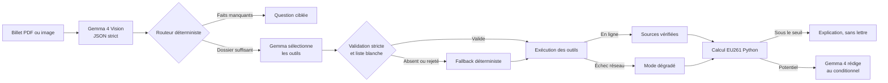

# Droit de Retard

[](https://github.com/Wesper-Dev/droit-de-retard/actions/workflows/tests.yml)

Assistant local de préparation de réclamations aériennes EU261, présenté au
**Gemma 4 Hackathon — Track 02: Autonomous Agents**.

À partir d'un billet PDF ou image, le prototype extrait les faits avec Gemma 4,
demande les informations manquantes, recherche des sources officielles et
calcule une indemnisation potentielle avec des règles Python déterministes. Il
peut refuser de générer une lettre et continue prudemment lorsque la recherche
web est indisponible.

> Ce prototype est informatif : il ne fournit pas de conseil juridique, ne
> représente pas le passager et ne garantit aucune indemnisation.

## Pourquoi un agent ?

Le résultat n'est pas systématiquement une lettre. Le pipeline choisit entre :

- demander le retard à l'arrivée ou une autre preuve manquante ;
- rechercher les règles et le canal de réclamation ;
- expliquer une non-éligibilité sans produire de lettre ;
- préparer une demande conditionnelle si les sources en direct sont
  indisponibles.

Le function calling natif Gemma/Ollama pilote les recherches. Gemma reçoit les
schémas JSON stricts des trois outils, produit `message.tool_calls`, puis un
dispatcher Python en liste blanche valide le nom et exige exactement les
arguments issus du contexte minimisé. Les résultats sont renvoyés au modèle
avec le rôle `tool` lorsqu'un second tour est nécessaire. Si un appel manque,
est invalide ou n'est pas produit, un fallback déterministe exécute uniquement
les outils autorisés et rend cette récupération visible dans la trace.

## Architecture



Gemma lit le document et rédige. Le code conserve la responsabilité des
seuils, de la distance, du montant et des branches de sécurité.

| Fichier | Rôle |
| --- | --- |
| `agent.py` | Extraction multimodale, routage, recherche, rédaction et trace |
| `eu261.py` | Distance et qualification EU261 simplifiées |
| `tools.py` | Recherche SerpApi minimisée, corpus local et récupération hors ligne |
| `knowledge/airline_policies/` | Corpus procédural local des compagnies |
| `app.py` | Serveur HTTP local sans dépendance Python externe |
| `static/index.html` | Interface de démonstration |
| `test_agent.py` | Tests déterministes |

## Prérequis

- Python 3.10 ou supérieur ;
- [Ollama](https://ollama.com/) avec `gemma4:12b` ;
- Poppler pour lire un PDF (`brew install poppler` sur macOS) ; les images
  PNG, JPEG et WEBP n'en ont pas besoin ;
- FFmpeg pour la dictée locale optionnelle (`brew install ffmpeg`) ;
- une clé SerpApi facultative pour la vérification en direct.

Le code d'exécution utilise uniquement la bibliothèque standard Python.

## Installation

Depuis un checkout du dépôt :

```bash
cd Gemma4-hackathon
python3 -m venv .venv
source .venv/bin/activate

ollama pull gemma4:12b
ollama serve
```

Dans un second terminal :

```bash
cd Gemma4-hackathon
source .venv/bin/activate
export DR_MODEL=gemma4:12b
```

Pour activer la recherche, exportez `SERPAPI_KEY` dans le processus de lancement
ou renseignez le fichier `.env` local ignoré par Git. La variable
d'environnement est prioritaire. Ne placez jamais de clé dans le code, une
commande enregistrée ou une capture de la démo.

## Lancer la démo

### Interface web

```bash
./demo.sh
```

Ce script vérifie Ollama, précharge `gemma4:12b`, démarre l'application et
ouvre le navigateur. Le lancement manuel reste disponible avec
`.venv/bin/python app.py`.

Ouvrez [http://127.0.0.1:7865](http://127.0.0.1:7865), chargez
`billet_avion_fictif.pdf`, puis décrivez l'incident :

```text
Le vol est arrivé avec 3 h 25 de retard après un problème technique.
```

La référence lue sur le billet doit être confirmée manuellement avant d'être
utilisée dans la lettre.

Le bouton **Dicter avec Gemma** enregistre au maximum 20 secondes, convertit
l'audio localement en WAV puis demande à `gemma4:12b` de le transcrire. Aucun
audio n'est envoyé à un service cloud et aucun fichier n'est conservé. La
transcription doit être relue et confirmée avant l'analyse. Cette fonction est
optionnelle : la saisie manuelle reste toujours disponible.

### Ligne de commande

```bash
.venv/bin/python agent.py billet_avion_fictif.pdf \
  --incident "Le vol est arrivé avec 3 h 25 de retard." \
  --booking-reference FQ7T2K
```

Le scénario fictif CDG–LIS illustre une indemnisation **potentielle** de 250 €
pour un retard déclaré à l'arrivée de 3 h 25. Le remboursement du billet est
évalué séparément. Pour un retard, le départ doit avoir été décalé d'au moins
5 heures **et** le passager doit déclarer avoir renoncé au voyage. Si ce choix
n'est pas renseigné, le résultat reste `needs_information` et l'agent pose la
question ; il ne déduit pas un remboursement du seul retard. Aurora Airlines
étant fictive, le prototype n'invente aucun formulaire réel.

Lors d'une exécution en ligne validée, Gemma a produit les trois `tool_calls`,
SerpApi a répondu, la qualification interne a pris le statut `likely` pour
250 € potentiels et le pipeline a duré environ 51 secondes. Cette mesure décrit
un passage sur la configuration de démonstration, pas une garantie de latence
ou d'éligibilité.

## Vérification

```bash
.venv/bin/python -m unittest -v test_agent.py
```

Les 85 tests couvrent le routage, la normalisation des durées, les seuils, les
tranches de distance, le remboursement séparé et la confidentialité des
recherches. Ils vérifient également les schémas d'outils, le parsing de
`tool_calls`, le retour `role=tool`, le rejet des fonctions ou arguments hors
liste blanche et le fallback déterministe. Les cas de remboursement prouvent
qu'un retard au départ d'au moins 5 heures sans choix explicite du passager
déclenche une question, tandis qu'un voyage abandonné peut ouvrir un résultat
conditionnel ou `likely`. Les appels Ollama doivent rester séquentiels pour
obtenir des mesures de latence comparables.

## Confidentialité et résilience

Le document, le nom et la référence de réservation sont traités par Ollama sur
la machine. Gemma ne reçoit pour la sélection d'outils que le type d'incident,
le trajet, les durées utiles et la compagnie. Les recherches SerpApi excluent
le nom du passager et la référence. Sans clé, en cas de quota ou de panne
réseau, les sources de référence sont affichées comme non vérifiées et la trace
le signale. Le verdict, lui, ne dépend pas du réseau : il découle des faits
déclarés et de la cause. Ce qui peut le rendre conditionnel, c'est une cause
susceptible de relever des circonstances extraordinaires, jamais une panne de
connexion. La lettre produite est enfin recoupée avec le moteur : un montant ou
une URL que le modèle aurait inventés sont corrigés ou signalés.

## Positionnement

Ce projet prépare un dossier que l'utilisateur contrôle ; il n'effectue ni
recouvrement ni action en justice. Contrairement aux services gérés à
commission, il conserve localement le document et prélève **0 %** d'une
éventuelle indemnité.

| Critère | Droit de Retard | AirHelp | Flightright |
| --- | --- | --- | --- |
| Modèle | Libre-service local | Recouvrement géré | Recouvrement géré |
| Commission annoncée | 0 % | 35 % TTC | 27 % + TVA |
| Supplément juridique | Aucun service juridique | 15 % TTC | 14 % selon le dossier |
| Trace et mode hors ligne | Visibles | Non revendiqués | Non revendiqués |

Sources : [frais AirHelp](https://www.airhelp.com/en-int/our-fees/),
[fonctionnement d'AirHelp](https://www.airhelp.com/en-int/blog/how-to-use-airhelp-to-claim-flight-compensation/),
[service Flightright](https://www.flightright.fr/blog/droit-aerien) et
[conditions Flightright](https://www.flightright.fr/wp-content/uploads/sites/4/2021/03/Conditions-Ge%CC%81ne%CC%81rales_FRA.pdf).
Ces services restent plus complets pour les relances et la représentation.

## Limites

- règles volontairement simplifiées pour les scénarios de démonstration ;
- 61 aéroports référencés dans le calcul local : un code absent produit
  `needs_information`, jamais une distance approximative. Un libellé contenant
  plusieurs aéroports référencés déclenche une question plutôt qu'un choix
  arbitraire ;
- seul le retard à l'arrivée est chiffré. Une annulation ou un refus
  d'embarquement renvoie `not_covered` : le droit existe peut-être, cet outil
  ne le calcule pas et le dit au lieu de laisser croire le dossier complet ;
- le Royaume-Uni est traité hors champ EU261 depuis le Brexit ; le régime
  UK261 n'est pas implémenté ;
- aucune vérification historique fiable d'un vol ou transporteur fictif ;
- aucun envoi automatique de réclamation ;
- corpus procédural local limité à trois compagnies : toute autre compagnie
  renvoie `not_found` plutôt qu'une procédure inventée.
