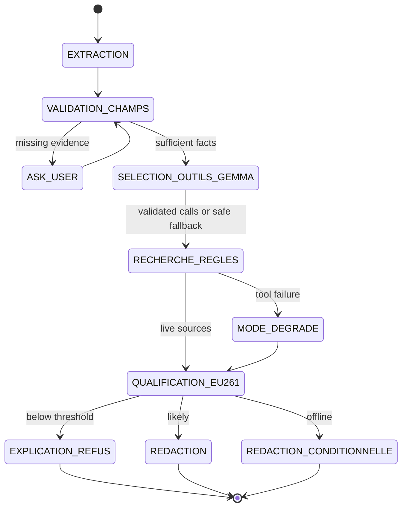

# Droit de Retard — A Local-First EU261 Claim Agent

**Track 02 — Autonomous Agents**

## The problem

A delayed passenger usually has three different questions:

1. What does my travel document actually prove?
2. Do the known facts cross an EU261 threshold?
3. Where and how should I submit a claim?

A letter generator can answer the third question while silently inventing the
first two. Droit de Retard instead treats uncertainty, refusal and tool failure
as normal outcomes. It is a local-first assistant that prepares a claim; it is
not a law firm, a recovery service or a promise of compensation.

## What we built

The user uploads a PDF or image and describes the disruption. Gemma 4 runs
locally through Ollama and extracts a strict JSON record from the document. A
deterministic router checks whether the flight and incident are sufficiently
described. If a critical fact is missing, the agent asks a targeted question
instead of inventing it.

For a complete case, the agent obtains official sources through privacy-
minimized tools, computes a simplified EU261 result in Python and branches:

- below the delay threshold: explain the refusal and generate no letter;
- potentially eligible with live sources: prepare a cautious claim;
- web search unavailable: keep the amount conditional and write without
  presenting an unverified rule as confirmed.

Ticket reimbursement is deliberately separate from EU261 compensation. For a
delay, the simplified refund branch requires at least five hours at departure
and an explicit statement that the passenger abandoned the trip. When that
choice is unknown, the agent returns `needs_information` and asks whether the
passenger travelled; the delay alone never proves a refund. Compensation uses
the delay at arrival, route and applicable exceptions.

## Agent architecture



The implementation is intentionally framework-free. Every transition is
returned in a trace so that a reviewer can see which tool or deterministic
rule produced each outcome.

### Gemma 4

Gemma 4 performs the two tasks where a generative multimodal model is useful:

- vision extraction from a travel document into a constrained schema;
- optional local speech-to-text for the traveller's incident statement;
- drafting a factual, polite letter from the extracted record and retrieved
  sources.

Both calls use temperature zero. The extraction prompt distinguishes visible
document evidence from a traveller statement, returns `null` for absent
values and marks the booking reference for manual confirmation.

For dictation, the browser records at most 20 seconds, the server converts the
in-memory recording to WAV with FFmpeg, and Gemma 4 transcribes it through the
local Ollama multimodal endpoint. The audio is not stored or sent to a cloud
speech service. Because a mistaken duration could change the outcome, the user
must review and confirm the transcript before analysis; manual entry remains
available at all times.

### Native function calling

The research stage uses Gemma/Ollama's native tool protocol. Gemma receives two
strict JSON tool definitions, and the orchestrator parses
`message.tool_calls`. It does not dynamically resolve a function name:
an explicit dispatcher accepts only `verify_air_passenger_rule` and
`find_claim_channel`.

Before dispatch, the code rebuilds the expected arguments from a minimized
context and requires the model's arguments to match exactly. Extra fields,
including a booking reference, cause the call to be rejected. After execution,
the assistant tool call and a `role=tool` result are appended to the messages,
allowing Gemma to request the second tool in another round.

Failure is safe and observable. If Gemma produces no call, an unknown tool,
unsafe arguments or only one of the two required calls, deterministic
orchestration completes the missing allowed operations. The trace records how
many calls were requested or rejected, whether tool results made a round trip,
and whether each operation came from Gemma or the fallback.

### Tools and deterministic safeguards

`verify_air_passenger_rule` searches institutional sources for the applicable
passenger-rights rule. `find_claim_channel` looks for the airline's official
claim path and refuses to fabricate one for the fictional demo carrier.

Gemma never calculates legal thresholds or compensation amounts. `eu261.py`
extracts IATA codes, computes great-circle distance with Haversine and applies
the simplified compensation bands. This separation makes the outcome
reproducible and prevents a fluent answer from changing a numeric rule.

## Privacy by construction

The travel document, passenger name and booking reference remain in the local
Ollama process. Gemma's tool-selection context contains only the disruption
type, route, useful delay values and airline. The legal-rule query is reduced
further to the incident and duration; the channel query contains the airline.
Deterministic tests verify that the passenger name and booking reference never
reach either tool selection or legal search.

This is also our product position. Managed recovery services can handle
follow-up and litigation, but require the claimant to transmit a dossier and
charge a success fee. Droit de Retard prepares a self-service dossier with no
commission and leaves submission under the user's control.

According to their official pages, AirHelp lists a 35% service fee and an
additional 15% legal-action fee, while Flightright describes a 27% fee plus VAT
and a possible 14% supplement for some legal cases:
[AirHelp fees](https://www.airhelp.com/en-int/our-fees/) and
[Flightright service](https://www.flightright.fr/blog/droit-aerien).
Those products remain stronger for recovery, follow-up and representation;
this prototype does not claim to replace them.

## Failure is a product state

The central Track 02 behavior is visible when contact with an external system
fails:

- no SerpApi key, timeout or exhausted quota activates `MODE_DEGRADE`;
- institutional reference links remain visible but are labelled unverified;
- the deterministic calculation may expose a potential amount in the
  interface, while the generated letter does not assert it as confirmed;
- a sub-threshold delay reaches `EXPLICATION_REFUS` and produces no letter;
- a ticket with no evidence of disruption reaches `ASK_USER`.

The fallback is not hidden. The trace reports the state, tool and outcome,
plus latency where it is measured.

## Demonstration scenario

The repository contains a fictional ticket for Aurora Airlines from Paris CDG
to Lisbon LIS. The traveller states that the flight arrived 3 h 25 late.

The verified deterministic path:

1. Gemma reads the ticket and extracts the flight facts.
2. Python normalizes `3 h 25` to 205 minutes.
3. The route is approximately 1,470 km.
4. The simplified rules place it in the €250 band, subject to evidence, cause
   and applicable exceptions.
5. The missing departure delay is reported separately for ticket
   reimbursement; even at five hours, the agent would still ask whether the
   passenger abandoned the trip.
6. Because Aurora Airlines is fictional, no real claim portal is invented.

This is an **illustrative potential compensation**, never a guaranteed result.

## Evaluation

At writeup drafting time, the repository reports:

- 32 deterministic unit tests passing;
- a validated online end-to-end run in approximately 47 seconds on the
  selected local setup;
- Gemma producing two native tool calls during that run, with SerpApi returning
  live results;
- the fictional CDG–LIS case reaching a `likely` €250 calculation, still
  subject to evidence, cause and applicable exceptions;
- explicit coverage for a ticket without incident proof, a delay below three
  hours, representative distance bands and the refund threshold plus explicit
  passenger choice.

Measured on the frozen build. Platform: MacBook Pro `Mac17,9`, Apple M5 Pro
(15 cores), 24 GB, macOS 26.5.2, Ollama 0.32.3, `gemma4:12b` at 11.9B
parameters, Q4_K_M quantization. All Ollama calls were run strictly one after
another, `temperature=0`, `think=false`, wall clock via `time.perf_counter()`.

| Evaluation | Metric | Observed |
| --- | --- | --- |
| Main scenario, 3 consecutive runs | Extraction, branch, total latency | 46.16 / 46.66 / 49.15 s — mean 47.32 s, σ 1.31 s (CV 2.8 %); identical €250 qualification each time |
| Per-stage cost | Vision / tool selection / drafting | 22.32 s / 3.78 s / 21.22 s on average |
| SerpApi online | Official live sources and claim channel | Validated — 2 sources kept, both under the official Your Europe reference |
| Forced tool failure | Recovery state and continued output | Validated — `MODE_DEGRADE`, `verified_live=false`, conditional letter asserting no amount, 47.44 s |
| Native function calling | Three selected tools, validated args, test suite | Validated — 3 tool calls per run, 0 rejected, 2 tool-result round trips, 85/85 tests |
| Early-exit branches | Cost of refusing rather than drafting | Ticket with no incident proof: 26.54 s to `ASK_USER`; +2 h 10 delay: 28.49 s to `EXPLICATION_REFUS`, no letter |
| Agent vs mono-prompt baseline | Accuracy, unsupported facts, latency | **Not measured** — see below |

Two honest caveats on this table. The tool failure was injected by disabling
the rule lookup, not by cutting the real network, so it proves the recovery
path rather than the network stack. And we do not claim superiority over a
single-prompt baseline: no harness in the repository runs a comparable
mono-prompt over the same document with the same scored outputs, so the
comparison would not be measurable honestly. We report what we ran.

## What did not work immediately

A travel ticket proved the itinerary but not the disruption, so the first
version could not responsibly qualify the case without a traveller statement.
The agent now stops and asks for the missing incident.

Live search was also unavailable when the API key was absent from the launching
process. Instead of crashing, the pipeline now marks the legal sources as
offline and preserves a conditional path. Finally, the demo airline is
fictional, which exposed an important failure mode: a search result cannot be
treated as proof of a claim channel that does not exist.

## Reproduce the demo

Prerequisites are Python 3.10+, Ollama with `gemma4:12b`, and Poppler for PDF
input. Runtime Python code uses the standard library.

```bash
python3 -m venv .venv
source .venv/bin/activate
ollama pull gemma4:12b
ollama serve
```

Then, in another terminal:

```bash
.venv/bin/python -m unittest -v test_agent.py
.venv/bin/python app.py
```

Open `http://127.0.0.1:7860`, upload `billet_avion_fictif.pdf` and enter:

```text
Le vol est arrivé avec 3 h 25 de retard.
```

Online search is optional. `SERPAPI_KEY` can be exported in the launching
process or stored in the local, Git-ignored `.env`; the environment takes
priority. Without a key, the recovery path is the expected behavior.

## Limits and next steps

The legal table and airport database are deliberately narrow, there is no
historical verification for a fictional flight, and the application neither
submits claims nor provides legal representation. Provenance per field,
contradiction arbitration and broader cancellation coverage remain future
work.

An optional local retrieval layer is planned for official airline procedures:
required documents, form URL and submission steps. It would answer “how do I
claim?” while `eu261.py` remains the only component deciding the simplified
eligibility calculation. For the small MVP corpus, versioned JSON or Markdown
and deterministic retrieval are preferable to an unnecessary vector database.
